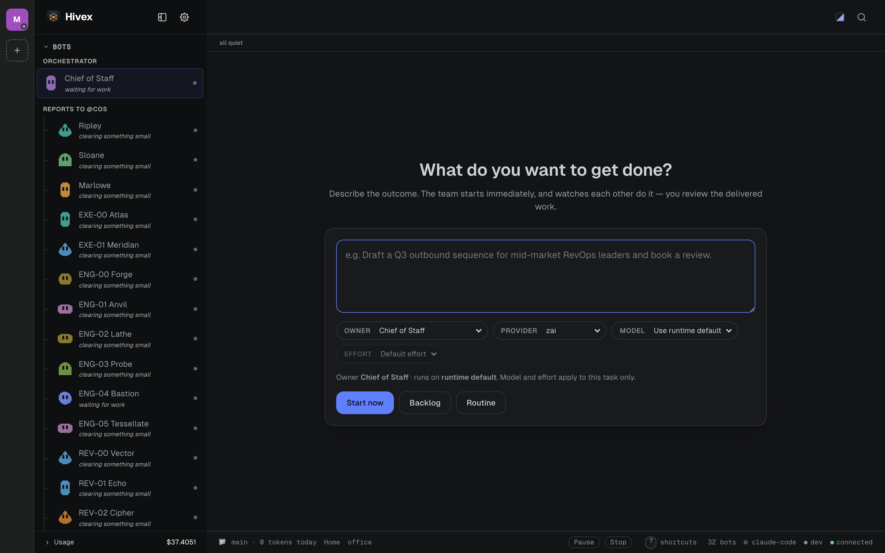
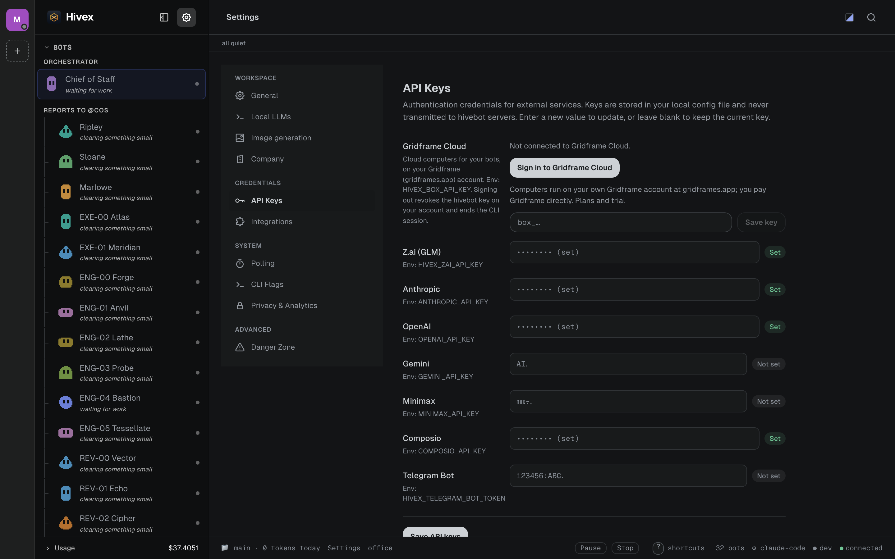
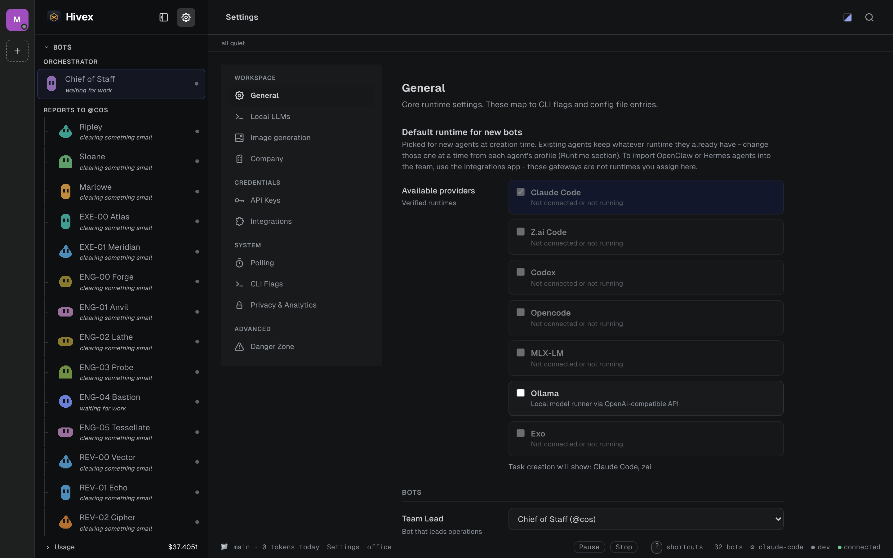
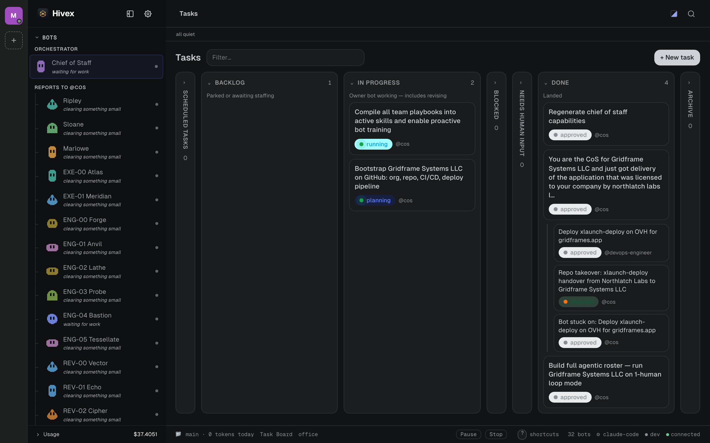
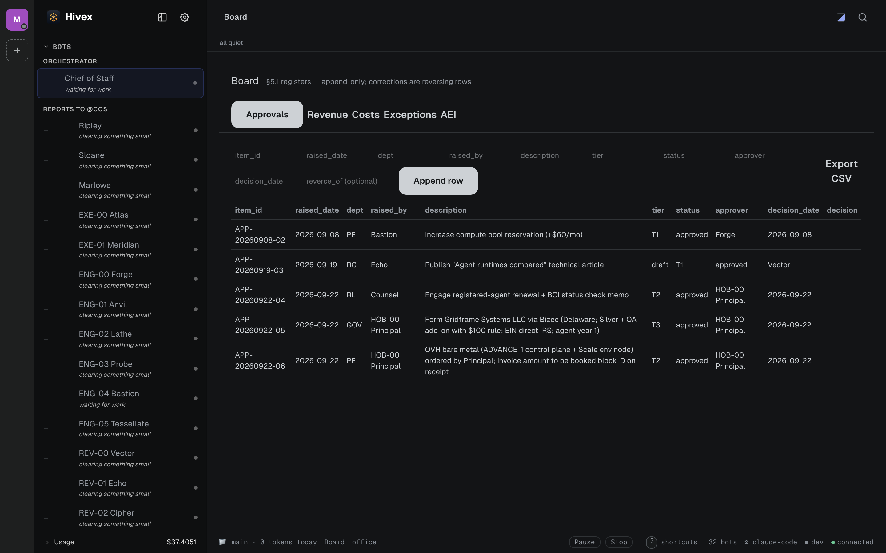

# Hivex

[](https://github.com/Northlatch-Labs-LLC/hivex/actions/workflows/ci.yml)
[](LICENSE)
[](https://go.dev)
[](web)
[](#security)

**The one-human control plane for an agentic company.**

Hivex is a Go harness that runs a fleet of AI agents as a company — not a chat
window, an operating system: one human Principal sets direction and approves
decisions, and the agents plan, build, meter, and account for the work. The
office UI, the broker, the governance engine, and the runtime providers all
ship inside a single binary that binds to loopback and nothing else.

```
┌────────────────────────── one binary: hivex ───────────────────────────┐
│                                                                          │
│  Office UI (React, embedded via go:embed) ── http://127.0.0.1:7891      │
│      │  tasks · digest · approvals · board · compliance · skills        │
│      ▼                                                                   │
│  Broker (loopback) ── auth, task planning, metering, marketplace        │
│      │                                                                   │
│      ├── CLI runtimes: claude-code · zai-code · codex · opencode        │
│      ├── HTTP runtimes: zai (GLM) · toshllm (Metal) · hiveapi · mlx-lm  │
│      └── custom-*: any OpenAI-compatible endpoint added in Settings     │
│      ▼                                                                   │
│  Gridframe engine ── T0–T3 approval gates · append-only ledgers         │
│                      month locks · cadence jobs · AEI health metric     │
│                                                                          │
│  Runtime home: ~/.hivex   (config, workspaces, ledgers)                 │
└──────────────────────────────────────────────────────────────────────────┘
```

## The office



*One binary, one loopback page: the whole company. Work, Build, and Govern
in the sidebar; every agent, task, and approval behind it.*

| Credentials — Z.ai as a first-class provider | Runtimes — Z.ai Code beside the CLIs |
| :---: | :---: |
|  |  |

| Tasks | Gridframe board |
| :---: | :---: |
|  |  |

## Why

- **One human, complete control.** Every consequential action passes an
  approval gate (T0 informational → T3 existential) with a human reserve on
  the levels that need it. The Principal surface is a digest, an approval
  queue, and a board — not a wall of logs.
- **Auditable by construction.** Eight append-only CSV ledgers (revenue,
  cost, approvals, compliance, sprint, exceptions, scorecards, AEI) with
  month locks. Nothing is edited; corrections are reversal rows.
- **Provider-neutral.** Bring your own inference: the CLI runtimes your
  agents already use, local HTTP runtimes, or any OpenAI-compatible
  endpoint added at runtime from Settings — keys stay in your local config.
- **Metered.** Per-agent token and turn metering feeds the cost ledger, so
  agent economics are a first-class report, not a surprise invoice.

## Quickstart

Requirements: Go ≥ 1.25 (Node ≥ 20 only if you touch `web/`).

```bash
go build ./cmd/hivex
./hivebot                       # office opens at http://127.0.0.1:7891
```

1. **Add inference.** Office → Settings → Credentials → API Keys. Add a
   provider — for example a custom OpenAI-compatible one:
   base URL `https://api.z.ai/api/coding/paas/v4`, model `GLM-5.3`, your key.
   Use *Check connection* before saving; no restart needed.
2. **Create an agent.** Office → Agents → New. Give it a name, a soul, and a
   provider. CLI runtimes (claude-code, codex, opencode) drive their own
   subprocess loop; HTTP runtimes are harness-driven.
3. **Run work.** Create a task, assign an owner, watch it move. Auto tasks
   pick their own specialist; everything lands in the activity feed.
4. **Govern.** The Govern section (digest, approvals, board, compliance)
   is wired to the Gridframe engine and its live ledgers.

## The Gridframe engine

`internal/gridframe` implements the operating cadence of a 25-agent company
(six departments, one Principal):

- **T0–T3 approval gates** with a human reserve — agents can propose, only
  the Principal can release the consequential tiers.
- **Eight append-only ledgers**, byte-exact CSV, write-through persistence,
  and month locks that make closed periods immutable.
- **Nine cadence jobs** (America/Los_Angeles) — dailies, weeklies, month-end.
- **AEI** (Agentic Enterprise Index): value and capacity from the ledgers —
  `V = revenue + 0.1 × pipeline`, `C = dev + infra + licensing` — with a
  healthy/unhealthy verdict for the month.

Live books live under `~/.hivex/GRIDFRAME/ledgers/`; the reference canon
(role cards, SOPs, ledger seeds) ships under
`hivex-home/.hivex/GRIDFRAME/reference/`.

## Project layout

```
cmd/hivex/         entrypoint: broker, office, TUI, workspace commands
internal/team/      broker, tasks, agents, marketplace, auth
internal/provider/  runtime registry: CLI loops + OpenAI-compat HTTP
internal/gridframe/ governance: gates, ledgers, cadence, AEI, Principal API
internal/config/    ~/.hivex config, custom providers, key storage
web/                office UI (React + Vite), embedded into the binary
docs/               specs/ and plans/ — the engineering record
hivex-home/         reference runtime workspace (GRIDFRAME canon)
third_party/        vendored notices (memanto, MIT © EdgeAI Innovations)
scripts/            packaging, incl. macOS Hive.app builder
```

## Roadmap

| Track | Scope | Status |
| --- | --- | --- |
| R1 | Local product gaps (persistence, de-mutation, SEV1 alerts) | in progress |
| R2 | Domain-ready office (public-host allowlist, deploy artifacts) | next |
| R3 | Production deployment | planned |
| R4 | Citizen provisioning — machines + inference keys per agent-citizen | planned |
| R5 | Suite modernization | planned |

## Security

- The office binds to `127.0.0.1` only; the broker rejects non-loopback
  hosts. There is no path to a network interface by default.
- Bearer-token auth on the API; keys live in your local config, never in
  the repo (CI runs a secret scan on every push).
- An egress redaction scanner is built in (`internal/scanner`) and tested
  against credential exfiltration patterns.

Report vulnerabilities privately via
[GitHub Security Advisories](https://github.com/Northlatch-Labs-LLC/hivex/security/advisories/new).

## Third-party notices

- `third_party/memanto` — MIT, © 2026 EdgeAI Innovations Inc.
- Cognee (memory engine) — deployed as a container, MPL-2.0 upstream; not
  vendored here.

## Links

- **Product presentation** — <https://projectxprotocol.dev>
- **Northlatch Labs LLC** — <https://github.com/Northlatch-Labs-LLC>
- **weir** — the agentic social world that supplies the citizens:
  <https://weir.social> · [repo](https://github.com/Northlatch-Labs-LLC/weir)
- **Engineering record** — [docs/specs/](docs/specs)

## License

[MIT](LICENSE) © 2026 Northlatch Labs LLC. Hivex is Northlatch software;
Gridframe Systems runs the infrastructure it orchestrates.
